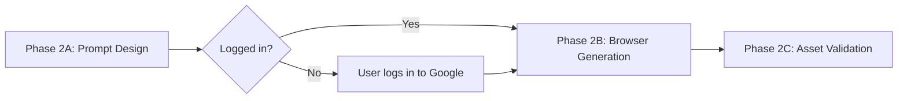

# keeponfirst-agentic-workflow-starter

> Tasks keep moving forward, even when you're not around.

An Agentic Workflow starter kit powered by **Antigravity (Orchestrator) + Nano Banana (Asset Generation) + Stitch (UI Design) + Jules CLI (Cloud Code Execution)**.

> **Google-first concept**: Default tools are from Google ecosystem (Stitch + Jules CLI). Pencil and Codex CLI are optional alternatives.

**[🚀 Interactive Onboarding Guide](docs/onboarding/index.html)** | **[🇹🇼 繁體中文版](docs/zh-TW/README.md)**

---

## 🧩 Install as Skill (Multi-IDE Support)

This workflow can be installed as a **global Skill** for multiple AI-powered IDEs — use it in any project without cloning this repo!

### Prerequisites

Before using this skill, install the required CLI tools:

```bash
# Jules CLI (for cloud code execution)
# See: https://jules.google
npm install -g @google/jules
jules login
```

### Installation by IDE

#### Antigravity

```bash
git clone https://github.com/keeponfirst/keeponfirst-agentic-workflow-starter.git
cp -r keeponfirst-agentic-workflow-starter/skills/keeponfirst-agentic-workflow ~/.gemini/antigravity/skills/
```

#### Cursor

```bash
git clone https://github.com/keeponfirst/keeponfirst-agentic-workflow-starter.git
cp -r keeponfirst-agentic-workflow-starter/skills/keeponfirst-agentic-workflow ~/.cursor/skills/
```

> **Note**: For Cursor, you may also add this to `.cursor/rules` or project-level `.cursorrules` file.

#### Claude Code (VS Code Extension)

```bash
git clone https://github.com/keeponfirst/keeponfirst-agentic-workflow-starter.git
cp -r keeponfirst-agentic-workflow-starter/skills/keeponfirst-agentic-workflow ~/.claude/skills/
```

> **Note**: Claude Code reads from `~/.claude/` or project-level `.claude/` directory.

#### OpenAI Codex App & CLI

```bash
git clone https://github.com/keeponfirst/keeponfirst-agentic-workflow-starter.git
cp -r keeponfirst-agentic-workflow-starter/skills/keeponfirst-agentic-workflow ~/.codex/skills/
```

> **Note**: Codex CLI can read instructions from `~/.codex/instructions.md` or `AGENTS.md`. Copy `SKILL.md` content to relevant file.

### Usage

Once installed, trigger the workflow in any workspace:

```
/kof                           # Shorthand trigger
KOF workflow add dark mode     # Natural language
用 KOF 開發新功能               # Chinese also works
```

**Trigger Keywords**: `/kof`, `KOF workflow`, `KOF agentic`, `keeponfirst workflow`, `keeponfirst agentic`

> 💡 **Why KOF?** We use specific trigger keywords to avoid conflicts with other agentic-type skills. Want different keywords? Just edit the `description` field in `SKILL.md`.

### What the Skill Provides

| Component | Description |
|-----------|-------------|
| `SKILL.md` | 5-phase workflow guide (PLAN → ASSETS → DESIGN → CODE → REVIEW → RELEASE) |
| `scripts/init.sh` | Initialize workflow structure in any project |
| `scripts/jules-watcher.sh` | Portable Jules session monitor |
| `templates/` | Human Gate & Tooling Checklist templates |

### Workflow Enhancements (v2.2)

This workflow now includes **8-phase pipeline** with enhanced UI quality controls:

#### v2.3 Changes (Feb 7, 2026)
| Enhancement | Description |
|-------------|-------------|
| **Stitch 3-Phase Workflow** | Design DNA → Visual Audit → Refinement Loop |
| **Design DNA Contract** | `design_dna.json` with color palette, components, negative constraints |
| **Visual Audit & QA** | Consistency check, color accuracy, component integrity |
| **Refinement Loop** | Auto-generated correction prompts until pass |

#### v2.2 Changes (Feb 6, 2026)
| Enhancement | Description |
|-------------|-------------|
| **Phase 0: INSIGHTS** | Market research & visual direction before planning |
| **Phase 1.5: WIREFRAME GATE** | Low-fidelity wireframe comparison before design |
| **Phase 2 ASSETS refactor** | Prompt files are now default; Nano Banana MCP is optional |
| **New directories** | `research/`, `wireframes/` for new phase outputs |
| **Prompt templates** | `prompts/antigravity/*.md` for insights, plan, wireframe_gate |

#### v2.1 Changes (Feb 5, 2026)
| Enhancement | Description |
|-------------|-------------|
| **Documentation Sync** | Phase 5 RELEASE now includes documentation sync step |

#### v2 Core Checkpoints
| Enhancement | Description |
|-------------|-------------|
| **Decision Snapshot** | PLAN phase summary with approved scope & open questions |
| **Human Gate Template** | Structured approval (scope/style/data model/risk) |
| **Design Verified Checklist** | Light/Dark mode, core components, out-of-scope elements |
| **tokens.json Contract** | Design system tokens (colors, typography, spacing, cornerRadius) |
| **Stitch Clean Room** | Element deletion list + HTML vs. screenshot conflict notes |
| **REVIEW Scope Rule** | Bug/偏差修正 only; scope changes return to PLAN |
| **Release Snapshot** | Acceptance items, known limitations, next steps |

### Initialize Workflow in a New Project

```bash
# From the skill directory (example for Antigravity)
bash ~/.gemini/antigravity/skills/keeponfirst-agentic-workflow/scripts/init.sh /path/to/your/project
```

This creates: `plans/`, `jules/tasks/`, `nanobanana/queue/`, `assets/generated/`, `templates/`

---

## Why I Built This Repo

The story behind this workflow:

1. **Subscribed to Gemini Pro** → Started exploring Google's AI tools ecosystem
2. **Discovered Nano Banana** → Tried using it for asset generation; quickly hit **quota limits**
3. **Jules opened for beta** → Found potential in 100 daily tasks as a cloud executor
4. **Integration concept formed** → Antigravity handles planning, Nano Banana handles prompt design (for external generation), Jules processes time-consuming coding tasks

**Core Values:**
- **Asynchronous Collaboration**: Jules keeps working while you sleep
- **Avoid Single-Point Quota Failures**: Distribute tasks across different tools
- **Full Traceability**: All prompts and tasks are preserved

---

## Workflow Pipeline

| Phase | Default Tool | Optional Tool | Responsibility |
|-------|-------------|---------------|----------------|
| **PLAN** | Antigravity | - | Planning, Decision-making |
| **ASSETS** | Nano Banana | - | Generate images, icons, UI assets |
| **DESIGN** | Stitch (Google) | Pencil | UI layout, wireframe, design system |
| **CODE** | Jules CLI (Google) | Codex CLI | Implement UI, write code, refactor |
| **REVIEW** | Antigravity | - | Code review, quality check |
| **RELEASE** | Antigravity | - | Release notes, version tag |

```
┌─────────────────┐
│   Antigravity   │  ← Extension of your brain for planning & decisions
│  (Orchestrator) │
└────────┬────────┘
         │
    ┌────┴────┐
    ▼         ▼
┌───────┐  ┌───────┐
│ Asset │  │Design │  ← Executors, each with its own role
│  Gen  │  │ Code  │
└───────┘  └───────┘
    │           │
    ▼           ▼
 assets/     code
```

**Default Tools (Google Ecosystem)**:
- **Design**: Stitch (via Gemini CLI or MCP)
- **Code**: Jules CLI (cloud async execution)

**Optional Alternatives**:
- **Design**: Pencil (mobile apps, design systems)
- **Code**: Codex CLI (local execution)

**MCP Configuration**:
- Stitch MCP wrapper: [`kof-stitch-mcp`](https://github.com/keeponfirst/kof-stitch-mcp)
- Example config: `.mcp.json.example`

---

## Execution Model

This repo is designed around a **Google-first toolchain** with the following core concepts:

### Role Definitions

| Layer | Role | Description |
|-------|------|-------------|
| Orchestrator | Antigravity | Planning, decision-making, coordinating Agents |
| Agent (Asset) | Nano Banana | Design asset prompts for external generation |
| Agent (Design) | Stitch (default) / Pencil (optional) | UI design and layout |
| Agent (Code) | Jules CLI (default) / Codex CLI (optional) | Execute code tasks |
| Adapter | `scripts/agent.sh` | Unified CLI entry point, bridging Orchestrator and Agents |

### agent.sh Positioning

`agent.sh` is an **Orchestrator Adapter**, not a standalone tool:

- **plan**: Generate planning templates (for Antigravity)
- **assets**: Prepare asset tasks to `nanobanana/queue/` (for Nano Banana)
- **design**: Prepare design tasks to `stitch/queue/` (for Stitch, default)
- **jules**: Prepare code tasks to `jules/tasks/` (for Jules CLI, default)
- **verify**: Validate project structure

### Safe Mode by Default

Scripts in this repo **do not directly call external APIs** — you can safely execute all commands:

```bash
./scripts/agent.sh plan    # Generates PLAN.md template, no quota consumed
./scripts/agent.sh assets  # Generates task queue, no quota consumed
./scripts/agent.sh jules   # Generates task files, no quota consumed
```

Actual Agent execution is done manually:
- Nano Banana: Generate via Web/App using prepared prompts
- Stitch: Use Gemini CLI `/stitch` command or MCP tools (default)
- Jules CLI: Use `jules new` command (default)
- Optional: Pencil (via Cursor Extension) or Codex CLI

This design lets you **dry-run** the entire workflow, confirm task content, then execute.

> **In short**: `agent.sh` is a "task preparation tool". It only generates plan, prompts, and task files — it won't call external APIs or trigger Jules. You can run it safely without consuming any quota.

### API Keys & Login

**Jules** doesn't necessarily require manual API key setup:

- **Most cases**: Just log in with your Google account after installation
- **API Keys are mainly for**: Non-interactive environments, automation scripts, or specific API calls

The `.env.example` in this repo provides API key fields, but this is **not required**. For interactive use of Jules, just log in to get started.

---

## Practical Usage Flow

> 💡 **Key Point**: In daily use, you only need to give commands to Antigravity. Scripts are helper tools, not required for manual execution.

### Starting the Workflow

Tell Antigravity (e.g., this IDE) any of the following:

```
/workflow Add a "dark mode toggle" feature for me
```

```
Follow the agentic workflow to implement a favorites feature
```

```
Use this repo's workflow to develop XXX
```

Antigravity will automatically execute the complete **PLAN → ASSETS → DESIGN → CODE → REVIEW → RELEASE** flow.

> **Default tools**: Stitch (Design) + Jules CLI (Code) - both from Google ecosystem.

### Typical Workflow (Manual)

1. **Describe requirements in Antigravity**
   ```
   I want to add a Tag Selector feature, please plan and generate a Jules task
   ```

2. **Antigravity will automatically**:
   - Generate `PLAN.md`
   - If assets needed, prepare prompts to `nanobanana/queue/`
   - If design needed, prepare design tasks to `stitch/queue/` (default: Stitch)
   - Prepare code tasks to `jules/tasks/` (default: Jules CLI)

3. **After submitting Jules task, tell Antigravity**:
   ```
   I've submitted the Jules task, session ID is 123456, please monitor it
   ```

4. **Antigravity runs watch**, automatically enters Review when Jules completes

5. **After Review is complete**:
   ```
   Looks good, please help organize the commit message and submit
   ```

### Script Command Reference

`scripts/agent.sh` is for advanced users or automation scenarios:

| Command | Purpose | When to Use |
|---------|---------|-------------|
| `plan` | Generate PLAN.md template | Antigravity calls automatically |
| `assets` | Prepare asset tasks | Antigravity calls automatically |
| `design` | Prepare design tasks (Stitch) | Antigravity calls automatically |
| `jules` | Prepare code tasks (Jules CLI) | Antigravity calls automatically |
| `watch <id>` | Monitor Jules session | Antigravity calls automatically, or run manually |
| `stitch-setup` | First-time Stitch extension setup | Run once to configure GCP Project ID |
| `stitch-check` | Check Stitch MCP connection status | Troubleshooting MCP issues |
| `verify` | Validate project structure | CI or manual checks |

---

## Quick Start (Initial Setup)

### 1. Clone & Bootstrap

```bash
git clone https://github.com/keeponfirst/keeponfirst-agentic-workflow-starter.git
cd keeponfirst-agentic-workflow-starter

# Initialize folders and environment variables
./scripts/bootstrap.sh
```

### 2. Generate a Plan

```bash
./scripts/agent.sh plan
# Output: PLAN.md
```

### 3. Generate Asset Tasks (for Nano Banana)

```bash
./scripts/agent.sh assets
# Output: nanobanana/queue/*.md
# Execute with Nano Banana Web/App one by one
```

### 4. Generate Design Tasks (for Stitch, optional)

```bash
./scripts/agent.sh design
# Output: stitch/queue/*.md
# Use Gemini CLI /stitch command or MCP tools
```

### 5. Generate Code Tasks (for Jules CLI)

```bash
./scripts/agent.sh jules
# Output: jules/tasks/*.md
# Use: jules new "task description"
```

### 6. Monitor Jules & Auto-Review (Optional)

```bash
# Create Jules session
jules new "implement feature X"

# Get session ID
jules remote list --session

# Start monitoring - auto-triggers Antigravity for code review upon completion
./scripts/agent.sh watch <session_id>
```

The `watch` command will:
- Poll Jules session status every 30 seconds
- Auto-execute `jules remote pull --apply` upon completion
- Wake Antigravity for code review via `agy chat --mode agent`
- Send system notifications

### 7. Validate Project Structure

```bash
./scripts/agent.sh verify
```

---

## Quick Verification (Optional)

After Quick Start, run these commands to confirm the environment is correct:

```bash
# Validate project structure and security
./scripts/agent.sh verify
```

This step confirms:
- Project directory structure is complete
- No sensitive information accidentally committed
- Environment is configured correctly

---

## Directory Structure

```
.
├── docs/                  # Workflow documentation
│   ├── ARCHITECTURE.md    # Architecture evolution story
│   ├── WORKFLOW.md        # Standard workflow
│   ├── STITCH_INTEGRATION.md   # Stitch MCP integration guide
│   ├── PENCIL_MCP_SETUP.md     # Pencil MCP setup (optional)
│   ├── PROS_CONS.md       # Pros and cons analysis
│   ├── QUOTA_STRATEGY.md  # Quota control strategy
│   └── SECURITY.md        # Security practices
│
├── prompts/               # Ready-to-use prompt templates
│   ├── antigravity/       # Prompts for Orchestrator
│   ├── gemini-cli/        # Asset generation prompts for Nano Banana
│   ├── stitch/            # Design task templates for Stitch
│   └── jules/             # Task templates for Jules CLI
│
├── scripts/               # Automation scripts
│   ├── agent.sh           # Single entry point
│   ├── bootstrap.sh       # Initialization
│   ├── watcher.sh         # Jules session monitor
│   ├── stitch_auth.py     # Stitch authentication helper
│   └── check_secrets.sh   # Sensitive info check
│
├── skills/                # Antigravity Skill package
│   └── keeponfirst-agentic-workflow/
│
├── examples/              # Examples
│   └── feature_tag_selector/
│
├── nanobanana/queue/      # Gemini CLI task queue
├── assets/generated/      # Generated assets
├── stitch/                # Stitch design files
│   ├── queue/             # Design task queue
│   ├── designs/           # Generated designs
│   └── completed/         # Completed design requests
└── jules/tasks/           # Jules CLI task queue
```

---

## Documentation

| Document | Description |
|----------|-------------|
| [ARCHITECTURE.md](docs/ARCHITECTURE.md) | How this workflow evolved |
| [WORKFLOW.md](docs/WORKFLOW.md) | Standard Feature Pipeline |
| [STITCH_INTEGRATION.md](docs/STITCH_INTEGRATION.md) | Stitch UI design integration |
| [STITCH_MCP_RUN_LOG.md](docs/STITCH_MCP_RUN_LOG.md) | Stitch MCP usage example (BabyLog) |
| [PENCIL_MCP_SETUP.md](docs/PENCIL_MCP_SETUP.md) | Pencil MCP setup (optional) |
| [PENCIL_MCP_AUTO_SETUP.md](docs/PENCIL_MCP_AUTO_SETUP.md) | How Pencil Extension auto-registers MCP |
| [PENCIL_NEXT_STEPS.md](docs/PENCIL_NEXT_STEPS.md) | Pencil advanced usage & code generation |
| [PROS_CONS.md](docs/PROS_CONS.md) | Pros, cons, and use cases |
| [QUOTA_STRATEGY.md](docs/QUOTA_STRATEGY.md) | Quota control strategy |
| [SECURITY.md](docs/SECURITY.md) | API Key security management |
| [TROUBLESHOOTING.md](docs/TROUBLESHOOTING.md) | Common issues (quota, Jules, retries) |

---

## Known Limitations

### Nano Banana Free Tier Limitation

> ⚠️ **Important**: Gemini CLI's Nano Banana extension does **NOT** support Free Tier API keys for image generation.

The image generation models (`gemini-2.5-flash-preview-image`, `gemini-3-pro-image`) have **quota limit: 0** on Free Tier accounts.

**Current Solution: Browser Generation Hybrid Flow**



1. **Phase 2A**: Antigravity creates detailed `.prompt.md` files in `nanobanana/queue/`
2. **Phase 2B**: Antigravity uses `browser_subagent` to:
   - Open [Gemini Web](https://gemini.google.com) in browser
   - **Check login status**: If not logged in, pauses and asks you to log in within that window
   - Submit prompt and wait for image generation
   - Capture generated image via element screenshot
3. **Phase 2C**: Antigravity validates assets and moves prompt to `completed/`

**Fallback (Manual Mode)**: If browser automation fails:
- User generates images manually at Gemini
- Tells Antigravity "圖產好了" or "/kof resume" to continue

**Resume Keywords**: `/kof resume`, `圖產好了`, `assets ready`

---

### agy chat Cannot Auto-Execute Prompts

Currently, `agy chat` CLI can only **open the window** but **cannot auto-fill and execute prompts**.

```bash
# This command only opens Antigravity, doesn't execute the prompt
agy chat --mode agent "Please review for me"
```

**Impact**:
- After watch completes, cannot automatically wake Antigravity for Review
- Need to manually tell Antigravity: "Please review the changes Jules just completed"

**Hoped Future Improvements**:
- Antigravity CLI supports sending and executing prompts directly
- Or provide extension API for third-party extensions to control chat

---

## License

MIT License - See [LICENSE](LICENSE)

---

## Contributing

Contributions to prompts and examples are welcome! See [CONTRIBUTING.md](CONTRIBUTING.md)
