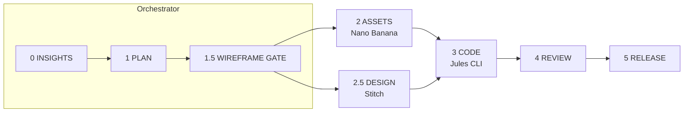

<div align="center">

# KOF Agentic Workflow

**Tasks keep moving forward, even when you're not around.**

An 8-phase agentic development workflow that turns AI coding tools into a coordinated team —
a planner, an asset generator, a UI designer, and a cloud coder — with human approval gates at every critical decision.

[](LICENSE)
[](CHANGELOG.md)
[](CONTRIBUTING.md)
[](https://github.com/keeponfirst/keeponfirst-agentic-workflow-starter/stargazers)

[Quick Start](#-quick-start) •
[How It Works](#-how-it-works) •
[Install as Skill](#-install-as-a-skill-multi-ide) •
[Docs](#-documentation) •
[🇹🇼 繁體中文](docs/zh-TW/README.md)

</div>

---

## Why this exists

Most AI coding sessions are synchronous: you prompt, you wait, you review, you repeat.
This workflow splits feature development across specialized agents so work continues **asynchronously**:

- 🌙 **Async collaboration** — cloud coding agents (Jules) keep working while you sleep; a watcher script wakes your orchestrator for review when they finish
- 🧯 **No single-point quota failures** — planning, asset generation, design, and coding run on different tools with independent quotas
- 🧾 **Full traceability** — every prompt, plan, and task is a versioned file in your repo; nothing lives only in a chat window
- ✅ **Human gates** — structured approval checkpoints (scope, wireframe, design DNA) so agents never run past your intent

**Works with your stack.** The pipeline is tool-agnostic: the default lineup is Google-first (Antigravity + Nano Banana + Stitch + Jules CLI), but each lane is swappable — the skill installs into **Antigravity, Cursor, Claude Code, or Codex**, and Pencil / Codex CLI slot in as design/code alternatives.

## 🚀 Quick Start

Install the workflow as a global skill (auto-detects your IDE):

```bash
curl -fsSL https://raw.githubusercontent.com/keeponfirst/keeponfirst-agentic-workflow-starter/main/scripts/install.sh | bash
```

Then trigger it in any project:

```
/kof                           # shorthand trigger
KOF workflow add dark mode     # natural language
用 KOF 開發新功能               # Chinese works too
```

Optional — for cloud code execution, install the Jules CLI:

```bash
npm install -g @google/jules && jules login
```

> Prefer a full project scaffold instead? See [Use as a project starter](#-use-as-a-project-starter).

## 🔄 How It Works



| Phase | What happens | Default agent | Alternative |
|-------|--------------|---------------|-------------|
| **0 · INSIGHTS** | Market research, visual direction (A/B/C) | Orchestrator | — |
| **1 · PLAN** | Scope, technical design, decision snapshot | Orchestrator | — |
| **1.5 · WIREFRAME GATE** | Low-fi structure comparison before styling | Orchestrator | — |
| **2 · ASSETS** | Images, icons, illustrations | Nano Banana | any image model |
| **2.5 · DESIGN** | Design DNA → Visual Audit → Refinement Loop | Stitch | Pencil |
| **3 · CODE** | Implementation (parallel cloud sessions) | Jules CLI | Codex CLI |
| **4 · REVIEW** | Diff review, UI verification | Orchestrator | — |
| **5 · RELEASE** | Release snapshot, commit, docs sync | Orchestrator | — |

Each phase ends with a **Human Gate** — a structured checklist you approve before agents proceed.
Logic-only tasks skip the visual phases (0, 1.5, 2.5).

Key design contracts along the way:

- **`design_dna.json`** — color palette (exact HEX + forbidden colors), typography, radii; every screen prompt inherits it
- **Visual Audit** — generated designs are checked against the DNA (nav consistency, color accuracy, component integrity) and auto-refined until they pass
- **Task files** — code work is written to `jules/tasks/*.md` first, so you review the brief before any agent runs

## 🧩 Install as a Skill (Multi-IDE)

The installer above handles this automatically. To install manually, copy `skills/keeponfirst-agentic-workflow/` into your IDE's skills directory:

| IDE | Skill directory |
|-----|-----------------|
| Antigravity | `~/.gemini/antigravity/skills/` |
| Cursor | `~/.cursor/skills/` (or reference from `.cursor/rules`) |
| Claude Code | `~/.claude/skills/` (or project-level `.claude/skills/`) |
| OpenAI Codex | `~/.codex/skills/` (or copy `SKILL.md` into `AGENTS.md`) |

**Trigger keywords:** `/kof`, `KOF workflow`, `KOF agentic`, `keeponfirst workflow` — deliberately specific to avoid clashing with other agentic skills. Edit the `description` field in `SKILL.md` to change them.

The skill package contains:

| Component | Description |
|-----------|-------------|
| `SKILL.md` | The 8-phase workflow guide agents follow |
| `scripts/init.sh` | Initialize the workflow structure in any project |
| `scripts/jules-watcher.sh` | Portable Jules session monitor |
| `templates/` | Human Gate & tooling checklist templates |

## 📦 Use as a project starter

Clone (or use as a template) to get the full scaffold — prompt libraries, task queues, and automation scripts:

```bash
git clone https://github.com/keeponfirst/keeponfirst-agentic-workflow-starter.git
cd keeponfirst-agentic-workflow-starter
./scripts/bootstrap.sh
```

`scripts/agent.sh` is the orchestrator's adapter — it **prepares** task files; it never calls external APIs, so every command is a safe dry-run that consumes zero quota:

```bash
./scripts/agent.sh plan          # generate PLAN.md template
./scripts/agent.sh assets        # queue asset prompts → nanobanana/queue/
./scripts/agent.sh design        # queue design tasks  → stitch/queue/
./scripts/agent.sh jules         # queue code tasks    → jules/tasks/
./scripts/agent.sh watch <id>    # monitor a Jules session, auto-review on completion
./scripts/agent.sh verify        # validate structure & scan for secrets
```

Actual execution happens in the agents themselves (Stitch web/MCP, `jules remote new`, Gemini web) — you review the prepared task files first, then run them.

In day-to-day use you don't touch the scripts at all — you just talk to your orchestrator:

```
/kof I want a Tag Selector feature — plan it and create the Jules task
...
I've submitted the Jules task, session ID is 123456, please monitor it
```

The watcher polls the session, applies the result with `jules remote pull --apply` on completion, and notifies you for review.

## 📁 Directory Structure

```
.
├── skills/keeponfirst-agentic-workflow/   # The installable skill (SKILL.md + scripts + templates)
├── prompts/                # Prompt libraries per agent (antigravity / gemini-cli / jules)
├── scripts/                # agent.sh, install.sh, bootstrap.sh, watcher.sh, check_secrets.sh
├── plans/                  # PLAN outputs
├── nanobanana/queue/       # Asset prompt queue
├── stitch/                 # Design task queue & outputs
├── jules/tasks/            # Code task queue
├── assets/generated/       # Generated assets
├── examples/               # Worked examples (BabyLog app, feature specs)
└── docs/                   # Architecture, integrations, troubleshooting
```

## 📚 Documentation

| Document | Description |
|----------|-------------|
| [Interactive Onboarding](docs/onboarding/index.html) | Visual step-by-step guide (served via GitHub Pages) |
| [ARCHITECTURE.md](docs/ARCHITECTURE.md) | How this workflow evolved |
| [WORKFLOW.md](docs/WORKFLOW.md) | Standard feature pipeline in detail |
| [STITCH_INTEGRATION.md](docs/STITCH_INTEGRATION.md) | Stitch UI design integration |
| [STITCH_MCP_RUN_LOG.md](docs/STITCH_MCP_RUN_LOG.md) | Real Stitch MCP session log (BabyLog example) |
| [PENCIL_MCP_SETUP.md](docs/PENCIL_MCP_SETUP.md) | Pencil MCP setup (optional design alternative) |
| [PENCIL_NEXT_STEPS.md](docs/PENCIL_NEXT_STEPS.md) | Pencil advanced usage & code generation |
| [PROS_CONS.md](docs/PROS_CONS.md) | Honest trade-offs and when to use this |
| [QUOTA_STRATEGY.md](docs/QUOTA_STRATEGY.md) | Quota distribution strategy |
| [SECURITY.md](docs/SECURITY.md) | API key security management |
| [TROUBLESHOOTING.md](docs/TROUBLESHOOTING.md) | Common issues (quota, Jules, retries) |
| [CHANGELOG.md](CHANGELOG.md) | Version history (v1.0 → v2.4) |

**MCP integrations:** [`kof-stitch-mcp`](https://github.com/keeponfirst/kof-stitch-mcp) · [`kof-nanobanana-mcp`](https://github.com/keeponfirst/kof-nanobanana-mcp) · example config in [`.mcp.json.example`](.mcp.json.example)

## ⚠️ Known Limitations

- **Nano Banana free tier** — Gemini image models have strict free-tier quotas (Pro models are paid-only since April 2026). The workflow's default is a browser-generation hybrid flow: the orchestrator prepares prompt files, drives [Gemini web](https://gemini.google.com) via browser automation, and falls back to manual generation (resume with `/kof resume` or `assets ready`). See [QUOTA_STRATEGY.md](docs/QUOTA_STRATEGY.md).
- **`agy chat` can't auto-execute prompts** — after a Jules session completes, the watcher opens Antigravity but you must manually ask it to review. Tracked as a hoped-for upstream improvement.

## 🤝 Contributing

Contributions to prompts, examples, and IDE adapters are very welcome — see [CONTRIBUTING.md](CONTRIBUTING.md).
Good first contributions: a new worked example, a prompt template for your stack, or an adapter guide for another IDE.

## ☕ Support

If this project saves you time, you can support development here:

<a href="https://www.buymeacoffee.com/keeponfirst" target="_blank"></a>

## 📄 License

[MIT](LICENSE)
