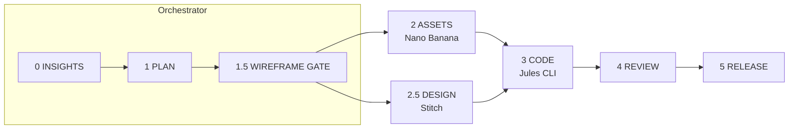

<div align="center">

# KOF Agentic Workflow

**人不一定在場，任務也能前進。**

一套 8 階段的 Agentic 開發工作流，把 AI 開發工具組成一個分工團隊——
規劃者、素材產生器、UI 設計師、雲端工程師——並在每個關鍵決策點設置人工審核關卡（Human Gate）。

[](../../LICENSE)
[](../../CHANGELOG.md)
[](../../CONTRIBUTING.md)

[快速開始](#-快速開始) •
[運作方式](#-運作方式) •
[安裝為-skill](#-安裝為-skill多-ide-支援) •
[English](../../README.md)

</div>

---

## 為什麼做這個

大多數 AI 開發流程是同步的：下 prompt、等待、審查、重複。這套工作流把功能開發拆給多個專職 agent，讓工作**非同步**推進：

- 🌙 **非同步協作** — 雲端 coding agent（Jules）在你睡覺時繼續工作；watcher 腳本會在完成時喚醒你的 orchestrator 進行審查
- 🧯 **避免單點配額耗盡** — 規劃、產圖、設計、寫程式分散在不同工具上，各自有獨立配額
- 🧾 **完整可追溯** — 每個 prompt、計畫、任務都是 repo 裡的版本化檔案，不會只存在於聊天視窗
- ✅ **Human Gate** — 結構化的審核清單（範圍、線框、Design DNA），agent 永遠不會越過你的意圖

**適配你的工具組合。** Pipeline 本身與工具無關：預設組合是 Google-first（Antigravity + Nano Banana + Stitch + Jules CLI），但每條線都可以替換——Skill 可安裝到 **Antigravity、Cursor、Claude Code、Codex**，設計與程式端也可換用 Pencil / Codex CLI。

## 🚀 快速開始

一行指令安裝為全域 Skill（自動偵測 IDE）：

```bash
curl -fsSL https://raw.githubusercontent.com/keeponfirst/keeponfirst-agentic-workflow-starter/main/scripts/install.sh | bash
```

之後在任何專案觸發：

```
/kof                           # 簡短觸發詞
KOF workflow 新增深色模式       # 自然語言
用 KOF 開發新功能               # 中文也可以
```

選用——雲端程式執行需安裝 Jules CLI：

```bash
npm install -g @google/jules && jules login
```

## 🔄 運作方式



| 階段 | 內容 | 預設 Agent | 替代方案 |
|------|------|-----------|---------|
| **0 · INSIGHTS** | 市場洞察、視覺方向（A/B/C） | Orchestrator | — |
| **1 · PLAN** | 範圍、技術設計、Decision Snapshot | Orchestrator | — |
| **1.5 · WIREFRAME GATE** | 上色前的低保真結構比較 | Orchestrator | — |
| **2 · ASSETS** | 圖片、icon、插畫 | Nano Banana | 任何產圖模型 |
| **2.5 · DESIGN** | Design DNA → 視覺審查 → 修正迴圈 | Stitch | Pencil |
| **3 · CODE** | 實作（支援平行雲端 session） | Jules CLI | Codex CLI |
| **4 · REVIEW** | Diff 審查、UI 驗證 | Orchestrator | — |
| **5 · RELEASE** | Release Snapshot、commit、文件同步 | Orchestrator | — |

每個階段結束於一個 **Human Gate**——由你核准的結構化清單，agent 才能繼續。純邏輯任務可跳過視覺階段（0、1.5、2.5）。

沿途的關鍵設計契約：

- **`design_dna.json`** — 色盤（精確 HEX + 禁用色）、字體、圓角；所有畫面 prompt 強制繼承
- **視覺審查（Visual Audit）** — 產出的設計會對照 DNA 檢查（導覽一致性、色彩準確度、元件完整性），不通過就自動生成修正 prompt 重跑
- **任務檔案** — 程式工作先寫進 `jules/tasks/*.md`，你先審過任務內容，agent 才執行

## 🧩 安裝為 Skill（多 IDE 支援）

上面的安裝腳本會自動處理。手動安裝則是把 `skills/keeponfirst-agentic-workflow/` 複製到 IDE 的 skills 目錄：

| IDE | Skill 目錄 |
|-----|-----------|
| Antigravity | `~/.gemini/antigravity/skills/` |
| Cursor | `~/.cursor/skills/`（或從 `.cursor/rules` 引用） |
| Claude Code | `~/.claude/skills/`（或專案層級 `.claude/skills/`） |
| OpenAI Codex | `~/.codex/skills/`（或將 `SKILL.md` 內容併入 `AGENTS.md`） |

**觸發關鍵字**：`/kof`、`KOF workflow`、`KOF agentic`、`keeponfirst workflow`——刻意使用專屬詞避免和其他 agentic skill 衝突。想改名就編輯 `SKILL.md` 的 `description` 欄位。

## 📦 作為專案起手式使用

Clone（或用 template）取得完整鷹架——prompt 庫、任務佇列、自動化腳本：

```bash
git clone https://github.com/keeponfirst/keeponfirst-agentic-workflow-starter.git
cd keeponfirst-agentic-workflow-starter
./scripts/bootstrap.sh
```

`scripts/agent.sh` 是 orchestrator 的 adapter——它只**準備**任務檔案，不會呼叫任何外部 API，所以每個指令都是安全的 dry-run、零配額消耗：

```bash
./scripts/agent.sh plan          # 產生 PLAN.md 模板
./scripts/agent.sh assets        # 排入產圖任務 → nanobanana/queue/
./scripts/agent.sh design        # 排入設計任務 → stitch/queue/
./scripts/agent.sh jules         # 排入程式任務 → jules/tasks/
./scripts/agent.sh watch <id>    # 監控 Jules session，完成後自動進入審查
./scripts/agent.sh verify        # 驗證結構與敏感資訊掃描
```

實際執行發生在各 agent 端（Stitch web/MCP、`jules remote new`、Gemini web）——你先審過準備好的任務檔，再執行。

日常使用不需要碰腳本，直接對 orchestrator 說話即可：

```
/kof 我想做一個 Tag Selector 功能，請規劃並建立 Jules 任務
...
Jules 任務已送出，session ID 是 123456，請幫我監控
```

Watcher 會輪詢 session，完成時以 `jules remote pull --apply` 套用結果並通知你審查。

## 📚 文件

| 文件 | 說明 |
|------|------|
| [ARCHITECTURE.md](../ARCHITECTURE.md) | 這套工作流的演進過程 |
| [WORKFLOW.md](../WORKFLOW.md) | 標準功能開發流程細節 |
| [STITCH_INTEGRATION.md](../STITCH_INTEGRATION.md) | Stitch UI 設計整合 |
| [STITCH_MCP_RUN_LOG.md](../STITCH_MCP_RUN_LOG.md) | Stitch MCP 實測紀錄（BabyLog 範例） |
| [PENCIL_MCP_SETUP.md](../PENCIL_MCP_SETUP.md) | Pencil MCP 設定（選用的設計替代方案） |
| [PENCIL_NEXT_STEPS.md](../PENCIL_NEXT_STEPS.md) | Pencil 進階用法與程式碼產生 |
| [PROS_CONS.md](../PROS_CONS.md) | 誠實的取捨分析與適用場景 |
| [QUOTA_STRATEGY.md](../QUOTA_STRATEGY.md) | 配額分散策略 |
| [SECURITY.md](../SECURITY.md) | API Key 安全管理 |
| [TROUBLESHOOTING.md](../TROUBLESHOOTING.md) | 常見問題（配額、Jules、重試） |
| [CHANGELOG.md](../../CHANGELOG.md) | 版本歷史（v1.0 → v2.4） |

**MCP 整合**：[`kof-stitch-mcp`](https://github.com/keeponfirst/kof-stitch-mcp) · [`kof-nanobanana-mcp`](https://github.com/keeponfirst/kof-nanobanana-mcp) · 設定範例見 [`.mcp.json.example`](../../.mcp.json.example)

## ⚠️ 已知限制

- **Nano Banana 免費層** — Gemini 產圖模型的免費層配額嚴格（Pro 模型自 2026 年 4 月起僅付費可用）。預設採用瀏覽器產圖混合流程：orchestrator 準備 prompt 檔案、以瀏覽器自動化操作 [Gemini web](https://gemini.google.com)，失敗時退回手動產圖（以 `/kof resume` 或「圖產好了」續跑）。詳見 [QUOTA_STRATEGY.md](../QUOTA_STRATEGY.md)。
- **`agy chat` 無法自動執行 prompt** — Jules session 完成後，watcher 只能打開 Antigravity 視窗，需手動請它進行審查。期待上游改進。

## 🤝 貢獻

歡迎貢獻 prompt、範例與 IDE adapter——見 [CONTRIBUTING.md](../../CONTRIBUTING.md)。

## ☕ 支持

如果這個專案幫你省下時間，歡迎請我喝杯咖啡：

<a href="https://www.buymeacoffee.com/keeponfirst" target="_blank"></a>

## 📄 授權

[MIT](../../LICENSE)
